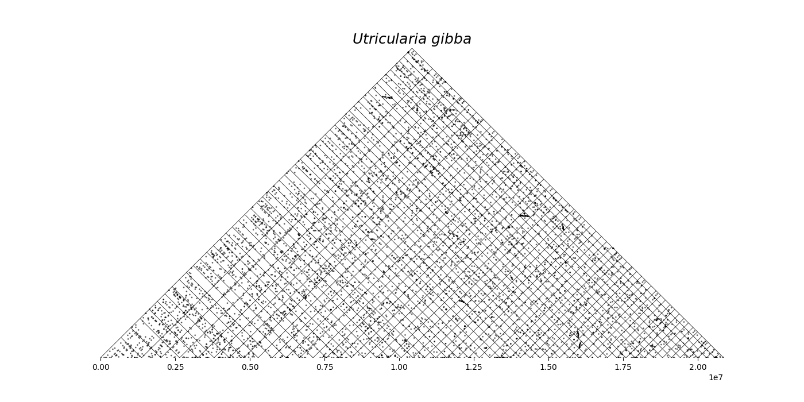

Make triangular within-genome dot-plots of blast hits, homologs, etc. using matplotlib.


## Example

From within the `example` directory of this repository:

```python
import dotplot
import matplotlib.pyplot as plt

pairs  = dotplot.parse_mcl("ugi.mcl")
coords = dotplot.parse_gff("ugi.gff", feature="mRNA", attribute="ID")
df, co, nf = dotplot.assemble_df(coords, pairs, anchors=None, minlen=2*10e4)

fig, ax = plt.subplots(1,1,figsize=(14,7))
ax = dotplot.genomescatter_triangle(ax, df, co, alpha=0.5, s=1, lw=0.5)
ax.set_title("$Utricularia\ gibba$", fontsize=18);
fig.savefig("ugi-fullparanome.dotplot.png")
```




## Installation

```
git clone https://github.com/arzwa/dotplot
cd dotplot
pip install .  # try pip3 if pip not found
```
